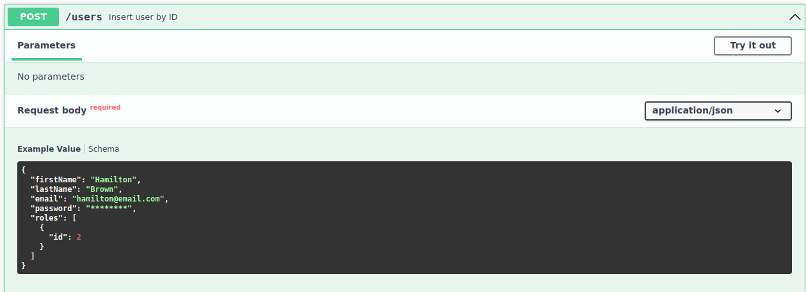
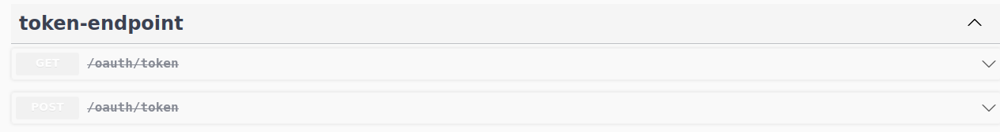
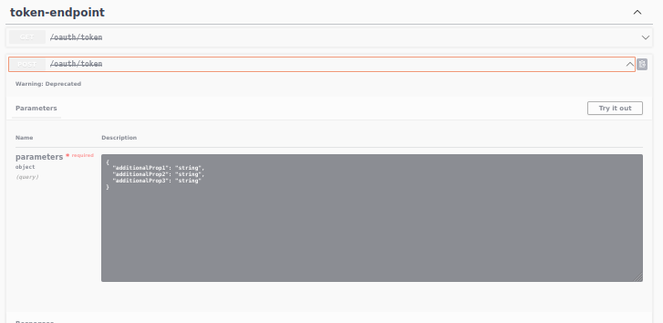
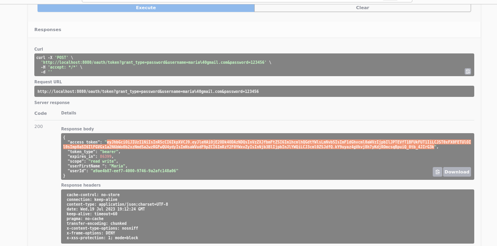
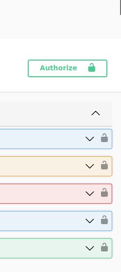
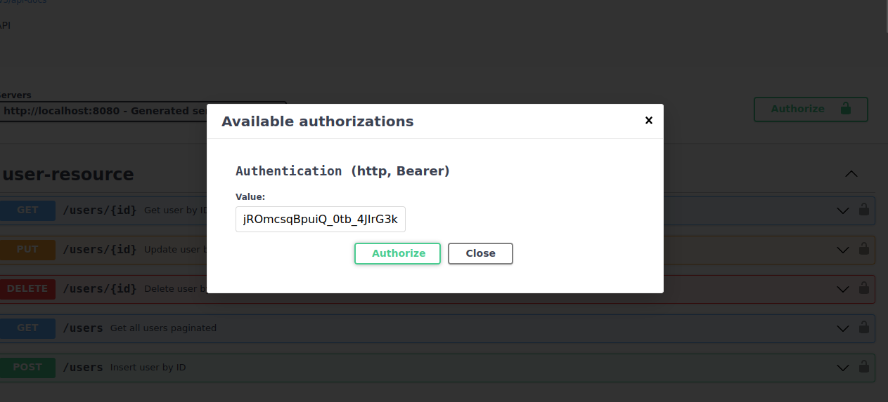

# Catalog
[](https://github.com/lucarlosmelo/catalog/LICENSE)
## Sobre o projeto

Este projeto foi criado com o objetivo de pôr em prática os conhecimentos adquiridos
com os estudos relacionados a API Rest e framework Spring utilizando a linguagem Java.

Como o próprio nome já diz, esta aplicação permite ao usuário catalogar produtos e suas categorias, a API 
realiza operações CRUD e, em algumas delas, é necesserário o usuário estar autenticado e autorizado a realizá-las.


### Tecnologias utilizadas

- Java 17
- Springboot 2.4.4
- Spring Data JPA
- Spring Security
- JUnit
- H2 database
- Springdoc - Swagger
- Postman
- Maven

### Modelo Conceitual


---
## Executando a aplicação 

### Pré-requisitos:

- [x] Java 17+

### Executando

- [x] Clone o repositório:

```
git clone https://github.com/LuCarlosMelo/catalog.git
```
<br>

- [x] Navegue até o diretório backend:

```
cd backend
```
<br>

- [x] Conceda permissão de execução ao arquivo mvnw:

```
chmod +x mvnw
```
<br>

- [x] Execute a aplicação:

```
./mvnw spring-boot:run
```
<br>

- [x] Abra o navegador e acesse a aplicação:

```
http://localhost:8080/swagger-ui/index.html#/
```
<br>

- [x] Projeto rodando corretamente: <br> <br>


---

## Acesso total a API 
 Este tutorial irá ajudá-lo a criar um usuário
 para ter acesso a todos os endpoints.

### Crie um novo usuário 

- [x] Vá até o método POST em User.<br> <br>

- [x] Insira o id 2 em roles para ter
acesso como ADMIN e poder realizar todas operações desta API. <br> <br>


### Realize autenticação para resgatar o Token

- [x] Procure o método Post em token-endpoint <br> <br>
 <br> <br>
 <br> <br>

- [x] Substitua os parâmetros presente no endpoint
/oauth/token pelo que está logo abaixo , insira 
seu username e password e execute o método.

```
{
  "grant_type": "password",
  "username": "your-username",
  "password": "your-password"
}
```

- [x] Copie o token gerado <br> <br>


### Autentique o token

- [x] Procure o botão "Authorize"
ou clique em qualquer representação de
um cadeado que fica ao lado dos endpoints. <br> <br>
   <br><br>

- [x] Insira o token e clique em "Authorize <br> <br>


---