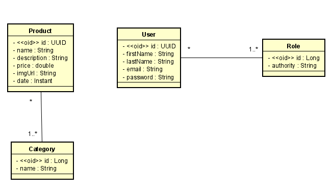
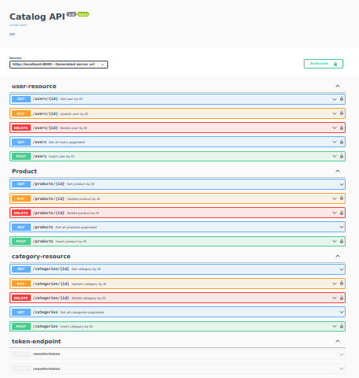

# Sobre o projeto

Este projeto foi criado com o objetivo de pôr em prática os conhecimentos adquiridos
com os estudos relacionados a API Rest e framework Spring utilizando a linguagem Java.

Como o próprio nome já diz, esta aplicação permite ao usuário catalogar produtos e suas categorias, a API 
realiza operações CRUD e, em algumas delas, é necesserário o usuário estar autenticado e autorizado a realizá-las.


## Tecnologias utilizadas

- Java 17
- Springboot 2.4.4
- Spring Data JPA
- Spring Security
- JUnit
- H2 database
- Springdoc - Swagger
- Postman

## Diagrama de classe



---
# Executando a aplicação 

## Requisitos:

- [x] Java 17+
- [x] Maven

## Executando

- [x] Clone o repositório:

```
git clone https://github.com/LuCarlosMelo/catalog.git
```
<br>

- [x] Navegue até o diretório backend e execute o comando para construir a aplicação:

```
mvn clean install
```
<br>

- [x] Execute a aplicação:

```
cd target
```
```
java -jar catalog-0.0.1-SNAPSHOT.jar
```
<br>

- [x] Abra o navegador e acesse a aplicação:

```
http://localhost:8080/swagger-ui/index.html#/
```
<br>

- [x] Projeto rodando corretamente:


---
